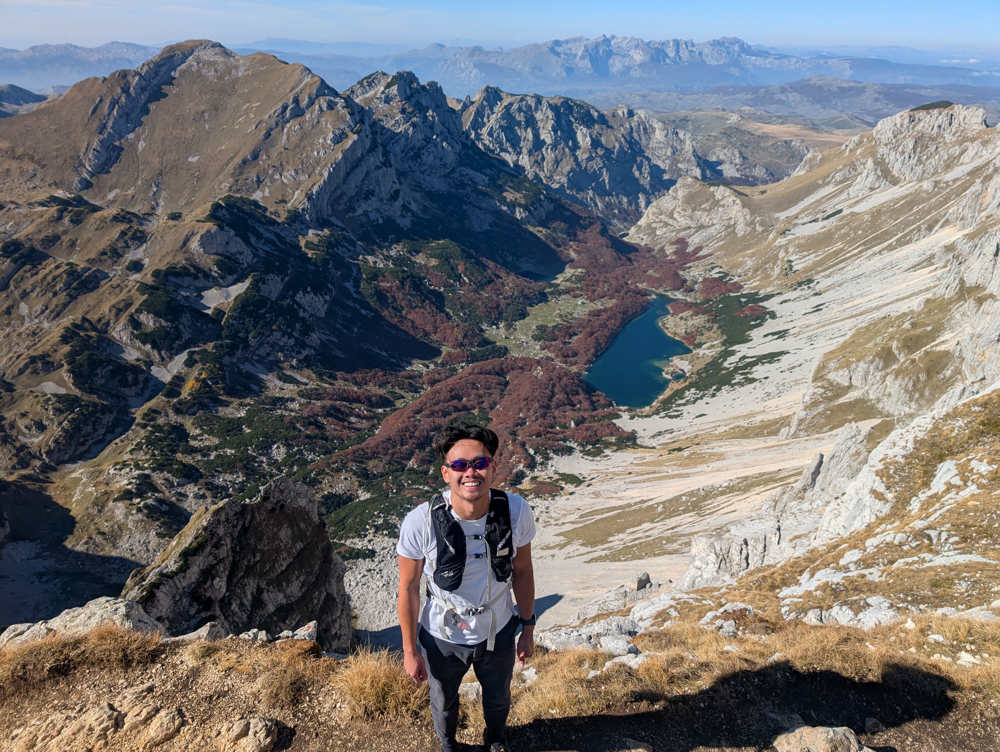
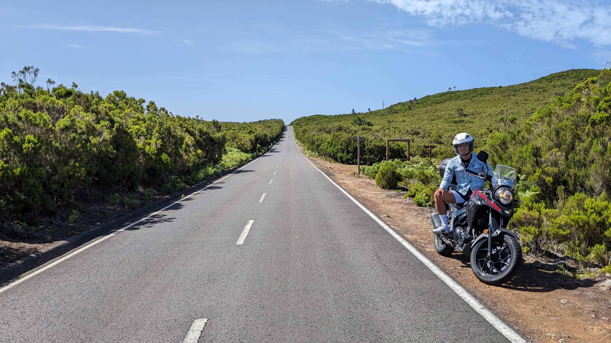
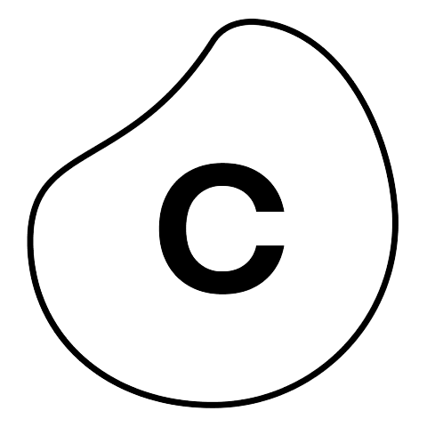

  

A bit about me ...

  


  
  
  
  
  
  
  


  

## Experience

<table style="width: 100%;">
    <thead>
        <tr>
            <th></th>
            <th>Company</th>
            <th>Role</th>
            <th>Date</th>
            <th>Location</th>
        </tr>
    </thead>
    <tbody>
        <tr>
            <td ></td>
            <td><a href="https://www.microsoft.com" target="_blank">Microsoft</a></td>
            <td>Cloud Solution Architect - Azure Infrastructure</td>
            <td>2022 - 2023</td>
            <td>Munich & Berlin</td>
        </tr>
        <tr>
            <td ></td>
            <td><a href="https://www.celonis.com" target="_blank">Celonis</a></td>
            <td>Inside Sales - Working Student</td>
            <td>2019</td>
            <td>Munich</td>
        </tr>
        <tr>
            <td ></td>
            <td><a href="https://www.loreal.com" target="_blank">L'Oréal</a></td>
            <td>Finance & Controlling - Intern</td>
            <td>2018</td>
            <td>Düsseldorf</td>
        </tr>
        <tr>
            <td ></td>
            <td><a href="https://www.pwc.com" target="_blank">PwC</a></td>
            <td>Demand & Product Management -   Working Student</td>
            <td>2017</td>
            <td>Düsseldorf</td>
        </tr>
        <tr>
            <td ></td>
            <td><a href="https://group.mercedes-benz.com/de/" target="_blank">Daimler</a></td>
            <td>Finance & Controlling - Intern</td>
            <td>2016 - 2017</td>
            <td>Ho Chi Minh City</td>
        </tr>
    </tbody>
</table>

## Education

<table style="width: 100%;">
    <thead>
        <tr>
            <th></th>
            <th>Institution</th>
            <th>Programme</th>
            <th>Location</th>
        </tr>
    </thead>
    <tbody>
        <tr>
            <td ></td>
            <td><a href="https://www.tum.de" target="_blank">Technical University of Munich</a></td>
            <td>Management and Technology (M.Sc.) </td>
            <td>Munich</td>
        </tr>
        <tr>
            <td ></td>
            <td><a href="https://english.jnu.edu.cn" target="_blank">Jinan University</a></td>
            <td>International Summer School, Chinese Language</td>
            <td>Guangzhou</td>
        </tr>
        <tr>
            <td ></td>
            <td><a href="https://www.ntu.edu.tw/english" target="_blank">National Taiwan Univesity</a></td>
            <td>International Exchange, Finance & Chinese Language</td>
            <td>Taipei</td>
        </tr>
        <tr>
            <td ></td>
            <td><a href="https://www.rub.de" target="_blank">Ruhr University Bochum</a></td>
            <td>Management & Economics (B.Sc.)</td>
            <td>Bochum</td>
        </tr>
    </tbody>
</table>

---

This website would never exist without [Hugo](https://gohugo.io/)
, "the world's fasted framework for building websites" and [Blowfish](https://blowfish.page/), an amazing and lightweight Hugo theme.   Check out their work and start your own website!

