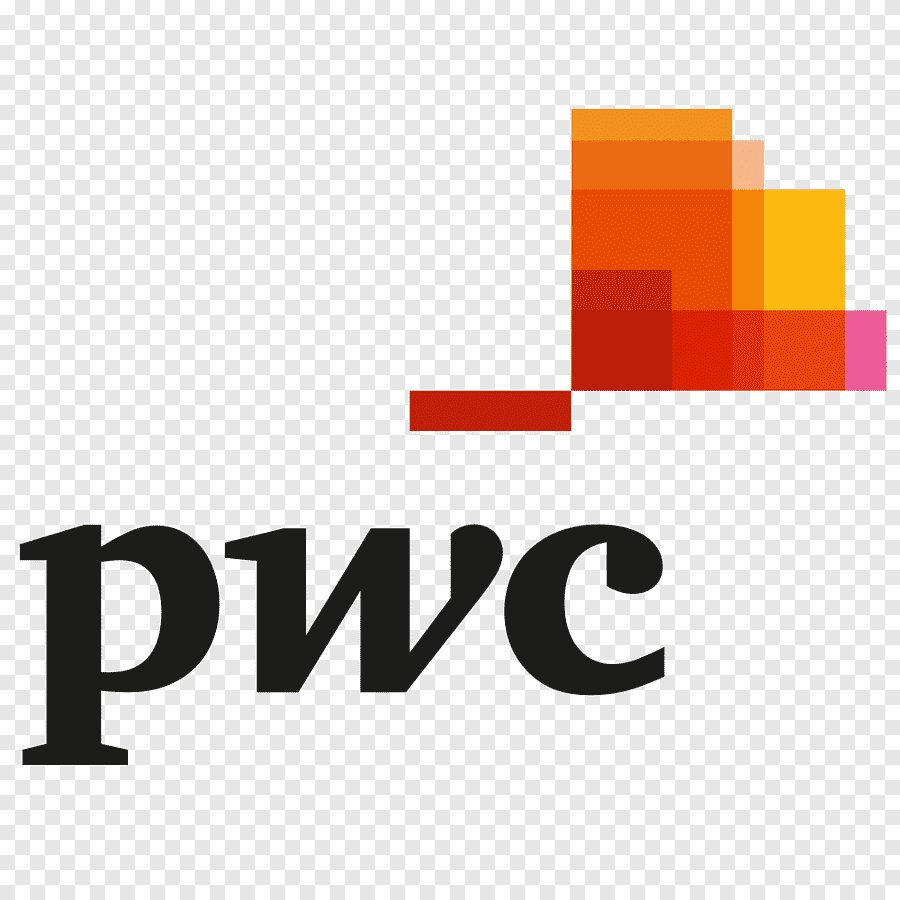

  

You've travelled far to get here, but I'm glad you've made it to my little blog. Now that you're here, I'm sure you're curious about the person behind it.

Let me tell you, I am certainly not a writer — well, until now. I'm exploring writing and creating blog posts as a new creative outlet alongside other pastimes, such as getting my hands bruised at the local climbing gym or fiddling with the latest technology. Yes, I am the kind of person who always has to buy the latest gadgets even after telling myself that the next generation isn't going to be much better and that I should stick to it for at least two years. But I guess that's just my curiosity and desire for new experiences shining through.

Above all, nothing is more important to me than human connection. All good things in the world spring out of mutual understanding, compassion, and kindness towards one another. That's what I believe in and what I try to practice in both my personal and professional life.

Some of my friends would describe me as a goofball who's fun to be around. Others say I'm a good listener for relationship crises or existential life questions. But at the end of the day, I try not to take life too seriously. 

Now scroll down for more about me!

 
 

### Some books I read 


  

### A few things I do 
  


  
  
  
  
  
  


  

### Where I worked

<table style="width: 100%;">
    <thead>
        <tr>
            <th></th>
            <th>Company</th>
            <th>Role</th>
            <th>Date</th>
            <th>Location</th>
        </tr>
    </thead>
    <tbody>
        <tr>
            <td ></td>
            <td><a href="https://www.microsoft.com" target="_blank">Microsoft</a></td>
            <td>Cloud Solution Architect - Azure Infrastructure</td>
            <td>2022 - 2023</td>
            <td>Munich & Berlin</td>
        </tr>
        <tr>
            <td ></td>
            <td><a href="https://www.celonis.com" target="_blank">Celonis</a></td>
            <td>Inside Sales - Working Student</td>
            <td>2019</td>
            <td>Munich</td>
        </tr>
        <tr>
            <td ></td>
            <td><a href="https://www.loreal.com" target="_blank">L'Oréal</a></td>
            <td>Finance & Controlling - Intern</td>
            <td>2018</td>
            <td>Düsseldorf</td>
        </tr>
        <tr>
            <td ></td>
            <td><a href="https://www.pwc.com" target="_blank">PwC</a></td>
            <td>Demand & Product Management -   Working Student</td>
            <td>2017</td>
            <td>Düsseldorf</td>
        </tr>
        <tr>
            <td ></td>
            <td><a href="https://group.mercedes-benz.com/de/" target="_blank">Daimler</a></td>
            <td>Finance & Controlling - Intern</td>
            <td>2016 - 2017</td>
            <td>Ho Chi Minh City</td>
        </tr>
    </tbody>
</table>

  

### What I studied

<table style="width: 100%;">
    <thead>
        <tr>
            <th></th>
            <th>Institution</th>
            <th>Programme</th>
            <th>Location</th>
        </tr>
    </thead>
    <tbody>
        <tr>
            <td ></td>
            <td><a href="https://www.tum.de" target="_blank">Technical University of Munich</a></td>
            <td>Management and Technology (M.Sc.) </td>
            <td>Munich</td>
        </tr>
        <tr>
            <td ></td>
            <td><a href="https://english.jnu.edu.cn" target="_blank">Jinan University</a></td>
            <td>International Summer School, Chinese Language</td>
            <td>Guangzhou</td>
        </tr>
        <tr>
            <td ></td>
            <td><a href="https://www.ntu.edu.tw/english" target="_blank">National Taiwan Univesity</a></td>
            <td>International Exchange, Finance & Chinese Language</td>
            <td>Taipei</td>
        </tr>
        <tr>
            <td ></td>
            <td><a href="https://www.rub.de" target="_blank">Ruhr University Bochum</a></td>
            <td>Management & Economics (B.Sc.)</td>
            <td>Bochum</td>
        </tr>
    </tbody>
</table>

---

This website would never exist without [Hugo](https://gohugo.io/)
, "the world's fasted framework for building websites" and [Blowfish](https://blowfish.page/), an amazing and lightweight Hugo theme.   Check out their work and start your own website!

  
